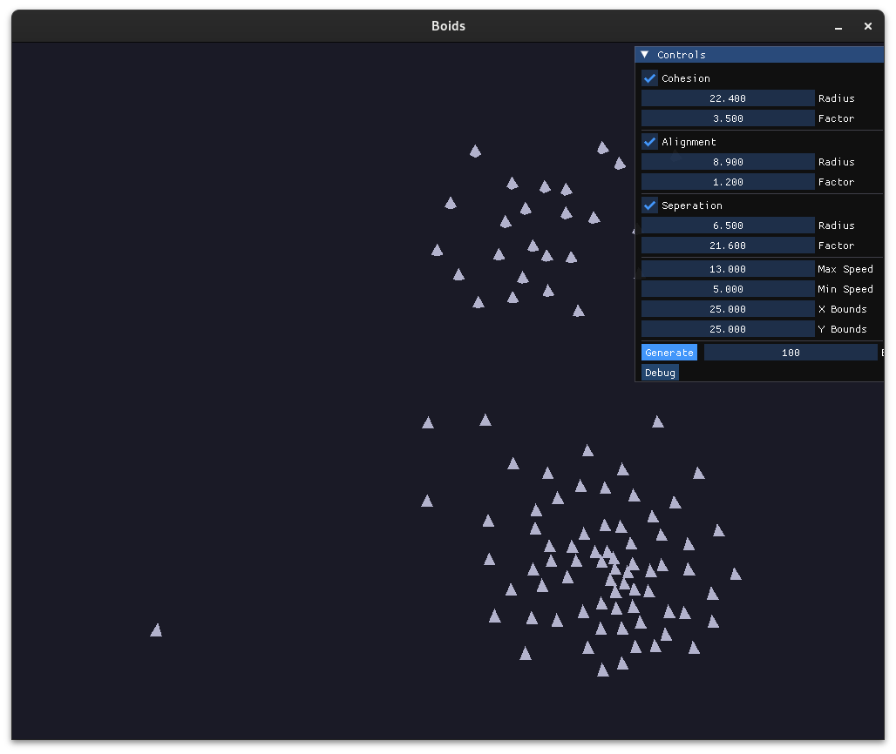

# Boids
A [Boids](http://www.red3d.com/cwr/boids/) simulation written in C++ using OpenGL, GLFW, glm and ImGui.



## How to build and run

```
   $ git clone --recurse-submodules https://github.com/sreedevcv/boids.git
   $ cd boids && mkdir build
   $ cmake -S . -B build/
   $ cmake --build build/
   $ ./boids 
```